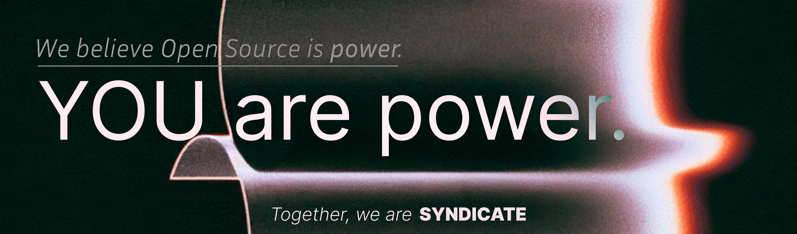

<!---->

## 🚀 Introduction
Welcome to **Syndicate** – the forefront of AI innovation. Our mission at **Insituate** is to empower enterprises with state-of-the-art, ready-to-use copilot templates. Syndicate is a cohort of the brightest tech minds dedicated to trailblazing the future of AI-driven solutions.

## 📚 Getting Started
Jump into our world of AI with ease:
```bash
git clone https://github.com/Insituate/Syndicate.git
cd syndicate
pip install -r requirements.txt
```
Explore our `docs` for detailed tutorials and guides.

## 🤝 Contribution Guidelines
Syndicate thrives on community contributions. Whether you're fixing bugs, adding features, or improving documentation, your help is welcome. Check out our `CONTRIBUTING.md` for more on our coding conventions and pull request process.

## 🏆 Leaderboard
| Rank | Innovator | Impactful Contributions | Contributions in Production | Explore Contributions |
|------|-----------|-------------------------|-----------------------------|-----------------------|
| 1    | [Alice](https://github.com/alice) | 42                        | 30                        | [Contributions](https://syndicate.insituate.com/contributions/alice) |
| 2    | [Bob](https://github.com/bob)   | 38                        | 27                        | [Contributions](https://syndicate.insituate.com/contributions/bob)   |
| 3    | [Carol](https://github.com/carol) | 35                        | 25                        | [Contributions](https://syndicate.insituate.com/contributions/carol) |
| 4    | [Dave](https://github.com/dave)  | 30                        | 20                        | [Contributions](https://syndicate.insituate.com/contributions/dave)  |
| 5    | [Eve](https://github.com/eve)   | 28                        | 18                        | [Contributions](https://syndicate.insituate.com/contributions/eve)   |


We celebrate achievements! Our leaderboard showcases the geniuses who've made significant contributions. Are you ready to rise to the top? See where you stand [here](https://syndicate.insituate.com/leaderboard).

## 🔑 How to Apply for Access Keys
Exclusive datasets await you. To get your key:
1. Join our community.
2. Submit a request via our `AccessKeyRequest` form.
3. Await your approval and unlock innovation.

## 🤖 Join Our Community
Become a part of something revolutionary. [Join us on Discord](https://discord.gg/syndicate) and [follow us on Twitter](https://twitter.com/insituate) for the latest updates.

## 🎁 Incentives and Recognition
Contributors can earn badges and swags and even feature in our annual **Syndicate Summit**. Your innovative solutions will not go unnoticed!

## 👩‍💻 Meet the Admins
Our admins are the guardians of Syndicate's mission:
- **Nishant** - Overlord
- **Atif** - Lead AI Architect
- **Ritik** - Chief of Data Sciences
- **Areeb** - June of Research Lab

## 🌐 Partnerships and Enterprise Clients
We collaborate with industry leaders like **NeuraLink Ltd** and **QuantumAI Corp.** to bring our community the best opportunities. Our enterprise clients include **TechFront** and **Innovatech Inc.**, who have transformed their operations with our templates.

## ⚖️ License
Syndicate is released under the MIT License. See `LICENSE` for more information.

